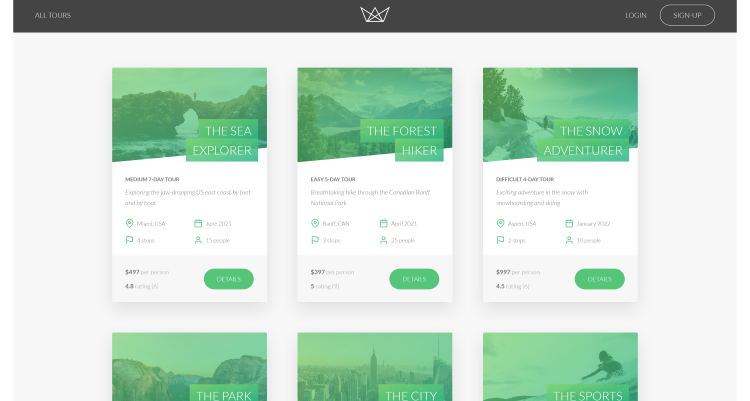
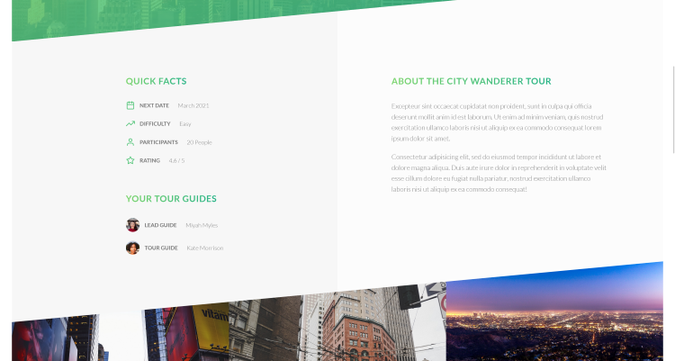
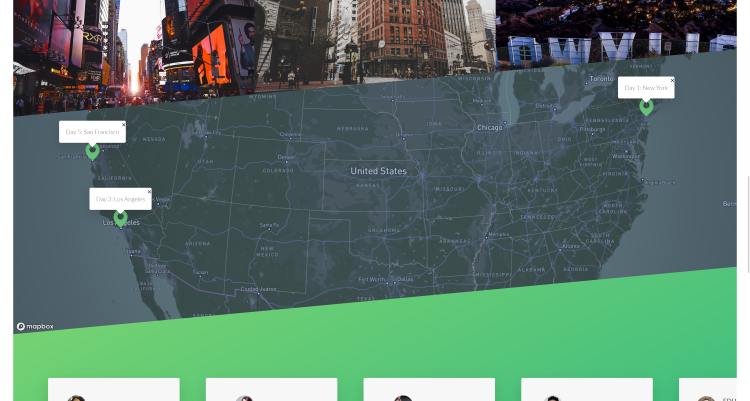
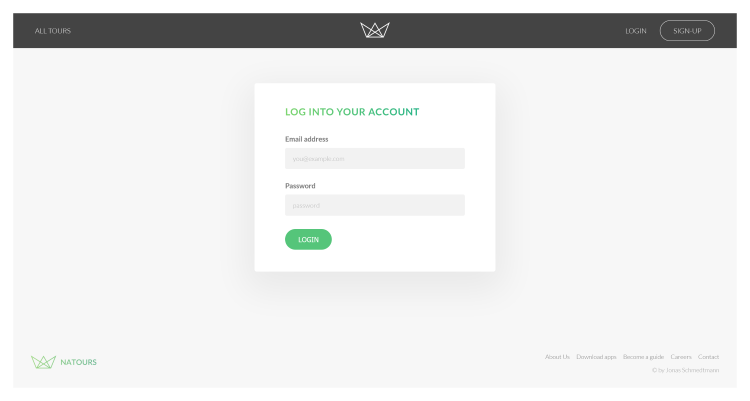
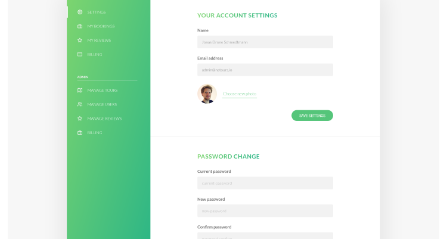
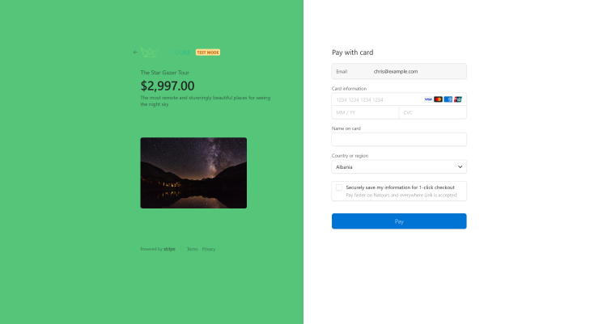
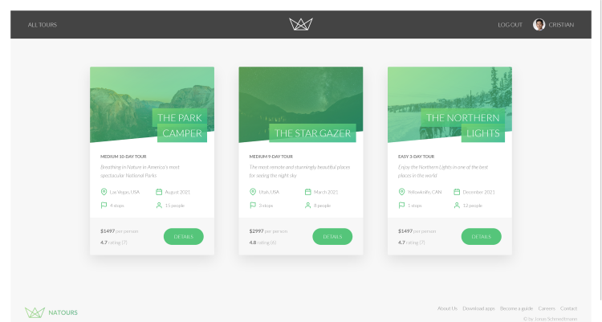
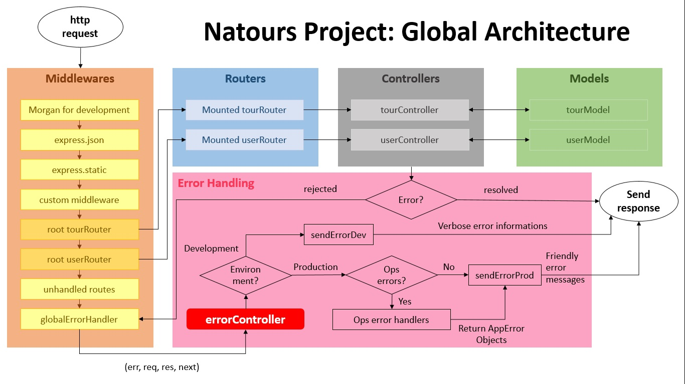

# Natours App

The Natours is a web based application for a tour company that offers nature tours in North America. Users can browse the available tours and purchase them using a secure Stripe api and they can find their purchased tours in the booking section in their own profile.

## Table of contents

- [Overview](#overview)
  - [Description](#description)
  - [Screenshot](#screenshot)
  - [Tools](#tools)
  - [What I have learned](#what-i-have-learned)
  - [Useful Resources](#useful-resources)

## Overview

### Description

Users should be able to:

- Login (using the example account) to the web application
- View each exisitng tour details on the tour browse page
- Purchase desired tours using the secure Stripe API
- View personal profile and edit personal information
- View purcahsed tours under "Bookings" section in user profile

### Screenshot

### Tools

- Node.js
- Express
- MVC architecture (MVC - Model, View, Controller)
- MongoDB Atlas
- Mongoose
- Postman
- JWT for authentication and authorization (using secure cookies)
- RESTful API design and development with advanced features: filtering, sorting, aliasing, pagination
- Advanced MongoDB: geospatial queries, aggregation pipeline, and operators
- Advanced data modelling: relationships between data, embedding and referencing
- Advanced error handling
- Server-side rendering with Pug templates
- Stripe payment portal implementation

### What I have learned

- Advanced usage of MongoDB and Mongoose and the RESTFUL API developement: This includes the usage of query strings and the development of query middleware and how to work with the request body. Building advanced data models that use child and parent referencing between them.

- Learning on how to use virtual population where you are able to fetch referenced documents that are not persisted in the database and display them in the query result. An example of this is how each individual tour can have many reviews and the reviews have their own model. Rather than creating a reference that persists in the DB, which could contain thousands of items, we can connect them through a virtual populate.

- Complex and Advanced Error Handling: here, I learned to separate the operational and programming errors. In this approach, you can send useful messages to the user if something goes wrong with user error and keep the programming errors for the developers to see only. Below is a flow chart (Credit: J.D. Browne) that helps illustrates the error handling functions.
  

- Full payment implementation using Stripe.

- Server-side rendering using Pug and Pug templates and Parcel bundler.

### Useful Resources

- [Node.js Docs](https://nodejs.org/en/docs/)
- [Express Docs](https://expressjs.com/)
- [MongoDB Docs](https://www.mongodb.com/docs/)
- [Mongoose Docs](https://mongoosejs.com/docs/)
- [Stripe API Docs](https://stripe.com/docs/api)
